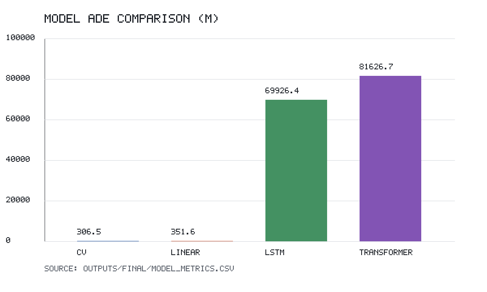

# The Simplicity Advantage in Maritime Trajectory Prediction

**Counter-intuitive findings: Simple methods outperform deep learning for short-term ship trajectory prediction**

[](https://opensource.org/licenses/MIT)
[](https://www.python.org/downloads/)
[](paper/conservative_manuscript.md)

## 🎯 Key Finding

The current conservative publication evidence pack shows that **simple kinematic baselines are strongest under the audited 15-minute AIS trajectory-prediction protocol**, while naive LSTM and Transformer baselines fail badly in the controlled final run:

| Method | Average Displacement Error | Performance Gap |
|--------|---------------------------|----------------|
| **Constant Velocity** | **306.5 m** | **1.0× (Best)** |
| Linear Least Squares | 351.6 m | 1.1× |
| LSTM baseline | 69,926.4 m | 228× |
| Transformer baseline | 81,626.7 m | 266× |

## 🚢 Dataset

- **Source**: Real NOAA AIS data from January 2, 2024
- **Audited processed split**: 43,216 train / 9,260 validation / 9,262 test trajectory samples
- **Coverage**: US coastal waters
- **Features in final NPZ**: WGS84 latitude/longitude, speed over ground, and course sine/cosine
- **Evidence manifest**: `outputs/audit/data_manifest.json`

## 🔬 Methodology

### Models Tested
1. **Constant Velocity (CV)**: Simple linear extrapolation
2. **Linear Least Squares**: Flattened-history regression baseline
3. **LSTM baseline**: Conservative recurrent baseline
4. **Transformer baseline**: Conservative attention baseline

### Evaluation
- **Metric**: ADE/FDE in Haversine meters; RMSE/MAE in local north/east component meters
- **Prediction horizon**: 15 minutes
- **Input sequence**: 30 minutes of historical data
- **Test set**: 9,262 trajectory sequences
- **Readiness audit**: `outputs/final/publication_readiness_report.json` reports `status=pass`

## 📊 Results

### Performance Visualization


### Key Insights
1. **Simple methods win in the audited run**: CV baseline achieves 306.5 m ADE.
2. **Naive deep baselines fail under the conservative protocol**: LSTM and Transformer errors are orders of magnitude larger than CV.
3. **Metric hygiene matters**: final metrics use verified WGS84 coordinates and Haversine/local-component meters.
4. **Practical implication**: the project currently supports a reproducibility/benchmark cautionary paper, not a deep-learning superiority paper.

## 🚀 Quick Start

### Conservative Publication Workflow

The current publication direction is documented in
[`PUBLICATION_IMPLEMENTATION_PLAN.md`](PUBLICATION_IMPLEMENTATION_PLAN.md), with the current publishability assessment in
[`PUBLICATION_CURRENT_STATUS.md`](PUBLICATION_CURRENT_STATUS.md). A higher-bar journal roadmap is in
[`HIGH_QUALITY_JOURNAL_ROADMAP.md`](HIGH_QUALITY_JOURNAL_ROADMAP.md). The active submission target is now **The Journal of Navigation**, with the working roadmap in
[`JOURNAL_OF_NAVIGATION_SUBMISSION_ROADMAP.md`](JOURNAL_OF_NAVIGATION_SUBMISSION_ROADMAP.md). This route keeps the paper conservative: only claims regenerated by repository artifacts under `outputs/final/`, `outputs/audit/`, or the audited high-quality outputs should appear in the manuscript.

```bash
# Create a fresh environment, then install dependencies
python3.11 -m venv .venv
source .venv/bin/activate
pip install -r requirements.txt

# Run auditable environment, data, model, statistics, and paper-table steps
PYTHON_BIN=.venv/bin/python bash scripts/run_final_experiment.sh
```

For quick infrastructure checks only, add sample caps:

```bash
PYTHON_BIN=.venv/bin/python bash scripts/run_final_experiment.sh --max-train-samples 1000 --max-test-samples 100
```

Publication numbers should only be cited when `outputs/final/run_manifest.json` records `"is_debug_run": false`. The generated manuscript tables and summaries are written to:

- `outputs/final/tables/model_metrics.md`
- `outputs/final/tables/model_metrics.tex`
- `outputs/final/figures/model_ade_bar.png`
- `outputs/final/figures/error_distributions.png`
- `paper/generated_results_summary.md`
- `paper/conservative_manuscript.md`
- `outputs/final/publication_readiness_report.json`

Current JON, high-quality, and domestic-journal manuscript candidates are:

- `paper/jon_manuscript.md`: The Journal of Navigation manuscript candidate
  generated from the current evidence pack.
- `paper/jon_manuscript.docx`: Word upload candidate for initial submission.
- `paper/jon_manuscript.pdf`: 15-page A4 review draft with embedded figures.
- `paper/jon_manuscript_zh.md`: Chinese working version of the JON manuscript.
- `paper/jon_manuscript_zh.docx`: Chinese Word export.
- `paper/jon_manuscript_zh.pdf`: Chinese A4 PDF export with embedded figures.
- `paper/jon_manuscript_zh_interpretation.md`: Chinese reader-facing
  interpretation of the paper's purpose, result, evidence boundary, and
  practical meaning.
- `paper/jon_manuscript_zh_interpretation.pdf`: PDF export of the Chinese
  interpretation.
- `paper/jon_cover_letter.md`: cover letter draft.
- `paper/jon_submission_checklist.md`: ScholarOne-oriented checklist.
- `paper/jon_authorial_polish_workflow.md`: mandatory authorial
  polish/de-template workflow for removing generated-report flavour while
  preserving required AI-use disclosure.
- `paper/jon_supplementary_materials.zip`: compact supplementary evidence
  archive, currently about 0.31 MB.
- `outputs/final_submission/jon_submission_manifest.json`: JON package
  generation manifest and claim boundary.
- `paper/submission_manuscript.md`: English evidence-synchronized candidate.
- `paper/submission_manuscript.pdf`: PDF export of the English candidate.
- `JOURNAL_OF_NAVIGATION_SUBMISSION_ROADMAP.md`: active JON route and remaining
  human submission tasks.
- `paper/submission_manuscript_zh.md`: Chinese domestic-journal-style
  candidate draft.
- `paper/submission_manuscript_zh.pdf`: A4 Chinese PDF export with embedded
  Chinese-capable font.
- `outputs/final_submission/readiness_report.json`: high-quality readiness
  audit, currently expected to report `submission_ready_candidate` and no
  blocking gaps before these outputs are cited.
- `outputs/final_submission/chinese_submission_manifest.json`: Chinese draft
  generation manifest.

Regenerate the JON package with:

```bash
.venv/bin/python scripts/make_jon_submission_pack.py
pandoc --resource-path=paper paper/jon_manuscript.md -o paper/jon_manuscript.docx
pandoc --resource-path=paper paper/jon_manuscript_zh.md -o paper/jon_manuscript_zh.docx
pandoc --resource-path=paper paper/jon_manuscript_zh_interpretation.md -o paper/jon_manuscript_zh_interpretation.docx
/Users/yuebao/.cache/codex-runtimes/codex-primary-runtime/dependencies/python/bin/python3 \
  scripts/export_markdown_pdf.py \
  --input paper/jon_manuscript.md \
  --output paper/jon_manuscript.pdf \
  --page-size a4 \
  --orientation portrait \
  --serif \
  --margin-inch 1.0
/Users/yuebao/.cache/codex-runtimes/codex-primary-runtime/dependencies/python/bin/python3 \
  scripts/export_markdown_pdf.py \
  --input paper/jon_manuscript_zh.md \
  --output paper/jon_manuscript_zh.pdf \
  --page-size a4 \
  --orientation portrait \
  --cjk \
  --margin-inch 0.65
/Users/yuebao/.cache/codex-runtimes/codex-primary-runtime/dependencies/python/bin/python3 \
  scripts/export_markdown_pdf.py \
  --input paper/jon_manuscript_zh_interpretation.md \
  --output paper/jon_manuscript_zh_interpretation.pdf \
  --page-size a4 \
  --orientation portrait \
  --cjk \
  --margin-inch 0.65
```

The underlying evidence pack is:

- `outputs/final/model_metrics.csv`
- `outputs/final/per_sample_errors.csv`
- `outputs/final/error_summary_by_horizon.csv`
- `outputs/final/error_summary_by_group.csv`
- `outputs/final/statistical_tests.json`
- `outputs/final/reproducibility_check.json`
- `outputs/final/data_quality_report.json`
- `outputs/audit/data_manifest.json`
- `outputs/audit/environment.json`

The processed NOAA arrays use WGS84 latitude/longitude coordinates, and the conservative runner reports ADE/FDE/RMSE/MAE in meters using Haversine/local-component distance calculations.

### Prerequisites
```bash
python 3.11
torch 2.12.0
numpy 2.4.5
pandas 3.0.3
scikit-learn 1.8.0
```

### Run Demo
```bash
# Clone repository
git clone [repository-url]
cd ship-prediction-avoidance

# Install dependencies
python3.11 -m venv .venv
source .venv/bin/activate
pip install -r requirements.txt

# Run demonstration
python demo_simple.py
```

### Legacy Full Pipeline
```bash
# Legacy exploration path, not the publication evidence path
./run_with_real_data.sh
```

## 📑 Academic Paper

Current conservative manuscript: [`paper/conservative_manuscript.md`](paper/conservative_manuscript.md)

**Title**: *A Reproducible Evaluation of Simple and Deep Learning Baselines for Short-Term Vessel Trajectory Prediction from AIS Data*

**Current evidence-backed abstract summary**: The audited final run uses 7,295,616 AIS records from 15,130 vessels to produce 43,216 training, 9,260 validation, and 9,262 test trajectory samples. Constant Velocity reaches 306.5 m ADE, Linear Least Squares reaches 351.6 m ADE, and the conservative LSTM/Transformer baselines fail with 69,926.4 m and 81,626.7 m ADE, respectively. The paper is framed as a reproducible benchmark and cautionary result, not as a deep-learning superiority claim.

## 🔍 Detailed Analysis

- **Publication readiness audit**: [publication_readiness_report.json](outputs/final/publication_readiness_report.json)
- **Statistical Analysis**: [statistical_tests.json](outputs/final/statistical_tests.json)
- **Metric stability**: [reproducibility_check.json](outputs/final/reproducibility_check.json)
- **Data audit**: [data_manifest.json](outputs/audit/data_manifest.json)
- **Model Comparison**: [model_metrics.csv](outputs/final/model_metrics.csv)

## 📁 Project Structure

```
├── src/                    # Core source code
│   ├── models/            # Model implementations
│   ├── dataio/            # Data processing
│   └── eval/              # Evaluation metrics
├── data/                  # Datasets
├── outputs/               # Results and analysis
│   ├── models/           # Trained models
│   ├── figures/          # Visualizations
│   ├── audit/            # Environment and data manifests
│   └── final/            # Publication evidence pack
├── paper/                # Generated conservative manuscript
├── configs/              # Configuration files
└── scripts/              # Training scripts
```

## 🎯 Impact

This research challenges the assumption that complexity automatically improves maritime trajectory prediction. Current supported implications:

- **Maritime Benchmarking**: Kinematic baselines must be treated as serious competitors
- **Operational Efficiency**: Lower computational requirements
- **AI Research**: Importance of metric hygiene, split documentation, and failure reporting
- **Practical Deployment**: Avoid relying on neural trajectory predictors without auditable evidence

## 📊 Reproducibility

The conservative evidence pack is reproducible with `PYTHON_BIN=.venv/bin/python bash scripts/run_final_experiment.sh`. Results include data checksums, per-sample errors, paired statistical tests, same-seed metric stability checks, generated tables/figures, and a readiness audit.

The higher-bar journal roadmap is reproducible as an extended pipeline:

```bash
PYTHON_BIN=.venv/bin/python \
DOWNLOAD_DATES=true \
bash scripts/run_high_quality_pipeline.sh
```

`DOWNLOAD_DATES=true` downloads the NOAA AIS dates listed in
`configs/experiment_multiday.yaml` before building the processed dataset. If
the raw files are already present in `data/raw/`, omit that variable.

For infrastructure checks only, cap the data and training sizes:

```bash
PYTHON_BIN=.venv/bin/python \
DOWNLOAD_DATES=true \
MAX_ROWS_PER_FILE=1000000 \
MAX_TRAIN_SAMPLES=512 \
MAX_TEST_SAMPLES=128 \
bash scripts/run_high_quality_pipeline.sh
```

Those capped results are smoke tests, not paper numbers. High-quality journal
claims require `outputs/final_submission/readiness_report.json` to report
`overall_status=submission_ready_candidate` and no `blocking_gaps`.

Current high-quality candidate artifacts include a four-date stratified
time-block NOAA AIS dataset, non-debug temporal and vessel-disjoint benchmarks,
neural proxy-tuning records, AIS-derived risk-warning metrics, and
`paper/jon_manuscript.md`. The current headline result is conservative:
`kalman_filter_cv` is best by ADE on both temporal holdout (1759.7 m) and
vessel-disjoint holdout (3109.4 m), while neural models do not support an
architecture-superiority claim.

## 🤝 Contributing

Contributions welcome! Please see our analysis methodology and contact us for collaboration opportunities.

## 📄 License

MIT License - see [LICENSE](LICENSE) file for details.

## 📞 Citation

```bibtex
@article{maritime_simplicity_2024,
  title={A Reproducible Evaluation of Simple and Deep Learning Baselines for Short-Term Vessel Trajectory Prediction from AIS Data},
  author={[Authors]},
  journal={To be selected},
  year={2026},
  note={Conservative reproducibility and benchmark manuscript with audited AIS evidence pack}
}
```

## 📈 Key Takeaway

**The current supported result is conservative:** under the audited protocol, Constant Velocity is strongest by ADE, while naive LSTM and Transformer baselines fail badly. Stronger deep-learning or collision-avoidance claims require new archived evidence.

---

⭐ **Star this repository if you found our counter-intuitive findings interesting!**
