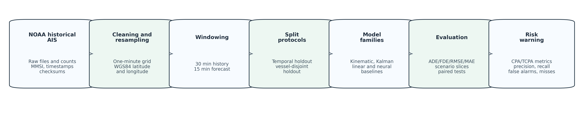
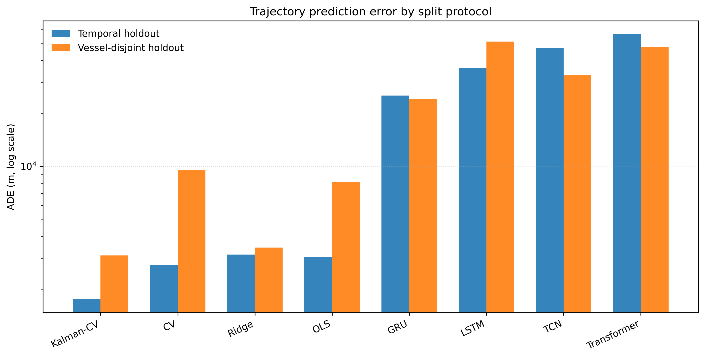
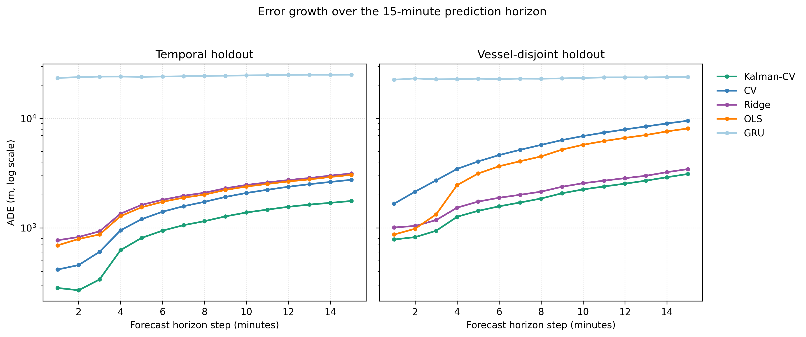
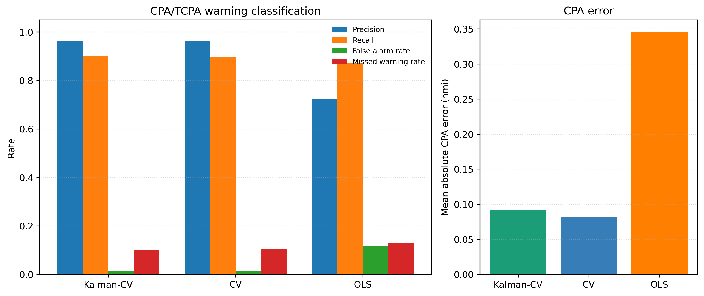
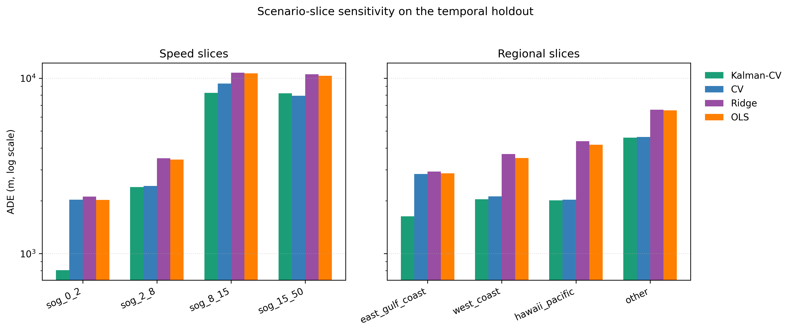
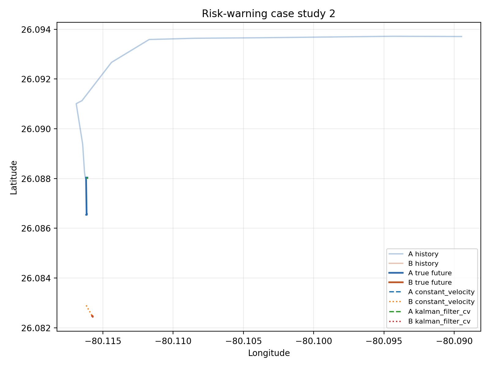

# 面向航行风险预警的AIS船舶轨迹预测可复现基准研究

文章类型：研究论文中文工作稿

作者：李波

单位：中国海事服务中心

通信作者：李波，li.bo@cmaritime.com.cn

## 摘要

船舶短时轨迹预测通常被表述为机器学习问题，但面向航行安全的应用还需要透明的基线模型、可复核的数据划分、泛化评估以及与风险预警指标之间的明确联系。本文构建了一个面向AIS历史数据的可复现轨迹预测与CPA/TCPA风险预警评估基准。当前证据包来自NOAA历史AIS数据，覆盖4个数据源日期（2024-01-02、2024-01-09、2024-02-06、2024-03-05），包含186,326个轨迹窗口和7,425个MMSI。每个样本使用30个一分钟历史位置预测未来15个一分钟位置。协议记录原始文件校验和、处理后文件校验和、船舶标识、时间、区域、航速、转向强度、时间保持划分和船舶不相交划分。实验比较运动学、Kalman风格、线性统计和神经网络基线，并进一步评估预测轨迹对AIS衍生CPA/TCPA预警精确率、召回率、误报率和漏报率的影响。当前非调试运行中，Kalman风格常速度模型在时间保持测试中取得1,759.7 m ADE，在船舶不相交测试中取得3,109.4 m ADE，均为最优。常速度模型在时间保持测试中仍是强基线（2,751.3 m ADE），但在船舶不相交测试中误差增大（9,553.5 m ADE）。在2,000个AIS衍生会遇场景中，Kalman风格常速度模型的预警精确率为0.963，召回率为0.900，误报率为0.012，漏报率为0.100。本文不宣称完成自主避碰验证；贡献在于提供一条可审计的航行预测与风险预警证据链，说明简单基线和下游预警指标应成为AIS预测论文的必要组成部分。

关键词：AIS；船舶轨迹预测；CPA/TCPA；风险预警；可复现基准；运动学基线

## 1 引言

船舶自动识别系统（AIS）为海上交通监测、港口态势感知、航线推断、异常检测和碰撞风险评估提供了重要数据基础。随着历史AIS数据规模扩大，越来越多研究尝试使用LSTM、GRU、Transformer等深度序列模型进行船舶轨迹预测。然而，在航行安全场景中，模型结构复杂并不自动等于证据更强。预测结果可能在某一种随机划分下表现较好，却在未见船舶、不同时间块或特定会遇场景中明显退化。仅报告平均位置误差也无法说明模型是否会减少漏报、误报或CPA/TCPA预警偏差。

本文关注的是方法论问题，而不是提出一个新的深度学习结构。许多AIS轨迹预测研究的可比性受限于数据清洗、插值、轨迹窗口构造、坐标度量、训练测试划分和基线模型实现。对于航行安全研究而言，预测模型只有在强基线、可复核划分和下游风险指标下仍然成立，才适合被描述为决策支持能力的提升。因此，本文提出三个研究问题：第一，简单运动学、线性统计和神经网络基线在统一短时AIS协议下表现如何；第二，模型排序在时间保持和船舶不相交测试中是否稳定；第三，轨迹预测误差如何影响CPA/TCPA风险预警精确率、召回率、误报率和漏报率。

本文的贡献包括三点。第一，建立保留MMSI、时间、数据源日期、区域、航速和转向强度等元数据的AIS基准流程，使同一处理后数据同时支持时间保持和船舶不相交测试。第二，在统一协议下比较运动学、Kalman风格、线性统计和神经网络模型，强调常速度及其平滑变体不是弱基线，而是短时航行预测中必须严肃对照的强基线。第三，将轨迹预测结果映射到CPA/TCPA风险预警指标，避免只凭ADE或FDE讨论航行安全意义。

## 2 相关工作

AIS数据已广泛用于船舶行为建模、航线发现、异常检测和短时预测。相关研究表明，船舶轨迹既受到航道、港口、交通组织和操作习惯约束，也受到AIS上报间隔、接收质量和机动行为影响。因此，AIS预测模型的性能很大程度上取决于预处理和评估协议。若只给出处理后的数组而不说明清洗、插值和划分方式，外部读者很难判断模型结果是否可复核。

短时预测任务中，简单运动学模型具有天然优势。多数船舶在几分钟到十几分钟尺度内保持相对稳定的航向和航速，常速度、常加速度和Kalman滤波模型能够以较低计算代价给出可解释预测。复杂模型若不能在同等协议下明显优于这些基线，其工程价值就需要重新审视。本文因此将常速度、常加速度和Kalman风格常速度模型作为核心基线，而不是把它们作为形式化对照。

神经序列模型具有较强非线性拟合能力，但也更依赖坐标表示、归一化、损失函数、训练预算和调参策略。本文纳入LSTM、GRU、Transformer和TCN基线，是为了记录这些常见模型在当前协议下的可复核表现，而不是否定神经网络在所有AIS预测任务中的潜力。更强的神经模型仍可能通过地图约束、船型信息、航路上下文、概率预测或会遇感知损失取得改进，但这些改进需要在强基线和严格划分下重新验证。

碰撞风险评估进一步要求把轨迹误差转化为航行相关指标。CPA和TCPA是会遇风险分析中的常见量，但它们并不等同于完整避碰决策。本文采用CPA/TCPA预警精确率、召回率、误报率和漏报率作为决策支持指标，保持在离线历史AIS评估范围内，不把结果表述为COLREGs合规或闭环自主避碰能力。

## 3 数据与可复现协议

本文使用NOAA MarineCadastre.gov公开AIS历史数据。当前处理后证据包覆盖2024-01-02、2024-01-09、2024-02-06、2024-03-05，时间范围为2024-01-02T00:00:00至2024-03-05T12:59:00，区域包括east_gulf_coast、hawaii_pacific、other、west_coast。数据清单记录原始文件校验和、处理后文件校验和、样本数量、MMSI数量、区域标签、平均航速、转向强度和插值比例。当前样本平均对地航速为2.22 kn，最大对地航速为34.88 kn，平均转向强度为17.69°，平均插值比例为0.181。

每个轨迹窗口使用一分钟间隔。模型输入为30个历史步，输出为15个未来步。处理后的坐标保持为WGS84经纬度，ADE和FDE采用Haversine距离，以米为单位；RMSE和MAE采用局部北东分量误差，同样以米为单位。这样可以避免把经纬度角度直接当作平面距离导致的指标误读。

时间保持划分包含130,428个训练样本、27,948个验证样本和27,950个测试样本。船舶不相交划分包含130,018个训练样本、28,597个验证样本和27,711个测试样本。前者考察后续时间块泛化，后者考察未见MMSI船舶泛化。两者均为历史数据协议，不能直接解释为实时AIS系统或全天候季节性验证。

图1给出从原始AIS到风险预警指标的证据链。



当前高质量审计报告状态为`submission_ready_candidate`，生成时无阻塞缺口。本文所有主要数值均由仓库中的`outputs/audit/`、`outputs/final_multiday/`、`outputs/final_risk/`和`outputs/final_submission/`文件生成。

## 4 模型与评价指标

基准包含九类模型：常速度、常加速度、Kalman风格常速度、普通最小二乘、岭回归、LSTM、GRU、Transformer和TCN。常速度模型由近期运动外推未来位置；常加速度模型进一步估计加速度；Kalman风格模型使用近期速度平滑降低噪声影响；线性模型将历史窗口映射到未来位移；神经网络模型作为常见序列学习基线。

主要轨迹指标为ADE、FDE、RMSE和MAE。ADE表示整个预测时域内预测位置与真实位置的平均Haversine距离，FDE表示最后一个预测步的Haversine距离。由于AIS误差分布具有明显偏态，本文除平均ADE外还报告中位ADE和经验95%区间。模型排序以平均ADE为主，同时结合风险预警指标讨论实际意义。

## 5 风险预警评价设计

风险预警实验从时间保持测试集中构造AIS衍生会遇场景。真实未来轨迹用于生成真实预警标签：若预测时域内真实最小CPA低于给定阈值，则该场景为正例。模型预测轨迹用于计算预测CPA/TCPA并产生预测预警标签，进而得到TP、FP、FN和TN。本文报告精确率、召回率、误报率、漏报率、平均提前时间误差和平均CPA绝对误差。

当前风险实验使用2,000个场景，来自5,000个评估样本；搜索半径为3.0 n mile，预警阈值为0.5 n mile，真实预警数量为520。该设计用于评价决策支持指标，而非验证自主避碰系统。

## 6 实验结果

图2展示主要模型在两种划分下的ADE。Kalman风格常速度模型在时间保持和船舶不相交测试中均为平均ADE最低的模型。常速度模型在时间保持测试中达到2,751.3 m ADE，但在船舶不相交测试中增至9,553.5 m ADE。岭回归在船舶不相交测试中达到3,446.9 m ADE，说明线性统计模型在未见船舶测试中仍具有竞争力。



表1给出完整轨迹预测结果。Kalman-CV在时间保持测试中的中位ADE为8.2 m，在船舶不相交测试中的中位ADE为9.2 m，但平均ADE仍达到公里级。这说明多数短窗口较容易预测，少量困难窗口显著拉高均值。

表1 轨迹预测结果

| 划分策略 | 模型 | 平均ADE/m | 中位ADE/m | 95% ADE区间/m | FDE/m |
|---|---|---:|---:|---:|---:|
| 时间保持测试 | Kalman-CV | 1,759.7 | 8.2 | 0.6至5,673.6 | 2,704.5 |
| 时间保持测试 | 常速度 | 2,751.3 | 20.5 | 0.7至5,357.1 | 4,469.8 |
| 时间保持测试 | 岭回归 | 3,141.7 | 1,563.1 | 451.4至11,189.3 | 5,079.5 |
| 时间保持测试 | 最小二乘 | 3,052.3 | 1,439.3 | 426.1至11,320.0 | 4,908.7 |
| 时间保持测试 | GRU | 25,215.5 | 19,597.5 | 3,979.9至92,526.6 | 25,571.8 |
| 时间保持测试 | LSTM | 36,039.2 | 25,660.5 | 4,365.6至116,019.1 | 36,116.8 |
| 时间保持测试 | TCN | 47,095.5 | 32,265.2 | 9,361.0至149,135.1 | 47,078.0 |
| 时间保持测试 | Transformer | 56,310.7 | 35,643.0 | 11,299.8至210,486.8 | 55,923.5 |
| 时间保持测试 | 常加速度 | 35,076.6 | 166.6 | 0.9至64,305.6 | 76,360.6 |
| 船舶不相交测试 | Kalman-CV | 3,109.4 | 9.2 | 0.6至11,946.7 | 5,979.6 |
| 船舶不相交测试 | 常速度 | 9,553.5 | 22.8 | 0.8至12,053.7 | 17,014.2 |
| 船舶不相交测试 | 岭回归 | 3,446.9 | 1,277.5 | 319.1至14,385.8 | 6,463.4 |
| 船舶不相交测试 | 最小二乘 | 8,113.3 | 930.0 | 261.2至12,478.9 | 14,869.8 |
| 船舶不相交测试 | GRU | 23,989.0 | 19,508.3 | 5,810.3至67,283.9 | 24,569.4 |
| 船舶不相交测试 | LSTM | 51,010.6 | 35,421.3 | 8,462.8至151,738.0 | 50,890.1 |
| 船舶不相交测试 | TCN | 32,833.1 | 24,902.1 | 4,013.2至95,171.4 | 34,379.1 |
| 船舶不相交测试 | Transformer | 47,559.1 | 33,691.0 | 10,991.1至138,971.6 | 45,907.0 |
| 船舶不相交测试 | 常加速度 | 36,237.1 | 175.1 | 1.0至37,008.8 | 67,988.2 |

当前神经网络基线未支持结构优越性结论。例如Transformer在时间保持测试中的ADE为56,310.7 m，明显高于Kalman-CV和常速度模型。这一结果不能推广为“神经网络不适合AIS预测”，但可以支持一个更稳妥的结论：若缺少严格预处理、调参和划分协议，朴素神经模型可能在短时AIS预测中明显失败。

图3展示预测时域内误差随步长增长的情况。该图有助于判断误差是早期即出现，还是主要在预测末端累积。



图4和表2展示CPA/TCPA风险预警结果。Kalman-CV的精确率为0.963、召回率为0.900；常速度模型的精确率为0.961、召回率为0.894。两者预警表现接近，但Kalman-CV的误报率和漏报率略低。最小二乘模型的误报率和CPA误差更高，说明位置预测误差与风险预警质量并非完全等价。



表2 AIS衍生风险预警指标

| 模型 | TP | FP | FN | TN | 精确率 | 召回率 | 误报率 | 漏报率 | CPA误差/n mile |
|---|---:|---:|---:|---:|---:|---:|---:|---:|---:|
| Kalman-CV | 468 | 18 | 52 | 1462 | 0.963 | 0.900 | 0.012 | 0.100 | 0.092 |
| 常速度 | 465 | 19 | 55 | 1461 | 0.961 | 0.894 | 0.013 | 0.106 | 0.082 |
| 最小二乘 | 453 | 173 | 67 | 1307 | 0.724 | 0.871 | 0.117 | 0.129 | 0.346 |

图5给出速度和区域场景切片结果。切片分析不用于宣称完整区域泛化，而是提醒读者：总体误差可能受低速样本、特定航区或少量困难样本影响。未来模型若只改善总体均值，却恶化关键场景切片，其航行安全价值仍需重新评估。



图6展示风险预警实验中的AIS衍生会遇案例。案例图可以帮助读者判断预警任务是否具有航行解释性，而不是只依赖指标表。



## 7 讨论

本文最重要的结论是保守但具有工程意义：在15分钟短时AIS预测任务中，简单、可解释的运动学基线仍然很难被轻易超越。Kalman风格常速度模型通过对近期速度进行平滑，在两种测试划分中均取得最低ADE。对于航行研究而言，这意味着新模型必须与强基线比较，而不能只与其他神经模型比较。

风险预警结果进一步说明，ADE并不是唯一的航行安全指标。Kalman-CV的ADE最低，但常速度模型在当前风险场景中的平均CPA误差略低。两者差异不大，却提醒我们：下游预警指标可能改变或细化对模型优劣的理解。面向航行决策支持的轨迹预测研究应至少包含一种与CPA/TCPA、会遇几何或预警行为相关的指标。

项目也具有现实应用意义。只要获取更新的历史AIS数据并按相同流程处理，就可以重新生成当前周期的轨迹预测、模型对比和风险预警候选结果。项目中的`predict_latest_ais.py`已经给出离线最新数据预测与风险预警导出流程。不过，这仍不是实时系统；若要进入实际应用，还需要实时AIS接入、延迟监控、不确定性估计、告警人因评估以及更完整的COLREGs和闭环仿真验证。

## 8 局限性

当前证据来自历史AIS数据，并不包含实时AIS流处理。四个数据源日期比单日实验更强，但不能证明全天候、季节性或全球泛化。处理后数据包含有用元数据，但尚未纳入天气、交通管制、精细船型、航道图约束或计划航线等因素。

风险预警实验是离线决策支持评估，不是船舶自主避碰验证，也不是COLREGs合规证明。正式运营系统还需要对误报容忍度、漏报后果、人机交互、VTS流程和安全认证进行独立评估。

参考文献仍需在正式投稿前进行最终DOI、卷期页码和期刊格式审校。该审校不影响当前数值证据，但会影响投稿文本的规范性。

## 9 结论

本文建立了从AIS数据审计、短时轨迹预测、时间/船舶泛化评估、场景切片分析到CPA/TCPA风险预警评价的可复现证据链。当前证据表明，Kalman风格常速度模型在时间保持和船舶不相交测试中均为最优ADE模型，常速度模型仍是强短时基线，朴素神经网络基线在当前协议下未能优于简单模型。本文的实践启示是：航行预测论文在提出复杂模型前，应先证明其相对于强运动学基线、严格划分协议和下游预警指标的实际收益。

## 数据与代码可用性

代码、配置、生成图件、紧凑证据文件和论文生成流程已公开于https://github.com/TristanLib/ais，归档标签为`jon-submission-v1.3`。当前稿件尚无单独归档DOI。源数据来自NOAA MarineCadastre.gov公开历史AIS文件；仓库不重新分发NOAA原始AIS文件或处理后的NumPy数组。

高质量证据包可通过以下命令复现：

```bash
PYTHON_BIN=.venv/bin/python DOWNLOAD_DATES=true DATES="2024-01-02 2024-01-09 2024-02-06 2024-03-05" bash scripts/run_high_quality_pipeline.sh
```

## 利益冲突声明

作者声明不存在利益冲突。

## 作者贡献

李波为本文唯一作者，负责研究构思、方法设计、软件流程、验证、形式化分析、结果解释、论文撰写和最终审定。

## 基金

本研究未获得任何公共、商业或非营利机构的专项资助。

## 致谢

作者感谢家人在本文准备过程中的耐心、鼓励和支持。

## AI工具使用声明

OpenAI Codex/ChatGPT在2026年5月被用于辅助代码生成、论文初稿组织、文档结构整理以及与仓库证据文件的一致性检查。作者对全部内容负责，并将在投稿前完成数值、参考文献、语言和图表的人工审校。

## 参考文献

Bai, S., Kolter, J. Z. and Koltun, V. (2018). An Empirical Evaluation of Generic Convolutional and Recurrent Networks for Sequence Modeling. arXiv:1803.01271. https://arxiv.org/abs/1803.01271.

Bergstra, J. and Bengio, Y. (2012). Random Search for Hyper-Parameter Optimization. Journal of Machine Learning Research, 13, 281-305.

Cho, K., van Merrienboer, B., Gulcehre, C., Bahdanau, D., Bougares, F., Schwenk, H. and Bengio, Y. (2014). Learning Phrase Representations using RNN Encoder-Decoder for Statistical Machine Translation. Proceedings of the 2014 Conference on Empirical Methods in Natural Language Processing, 1724-1734. doi:10.3115/v1/D14-1179.

Dalsnes, B. R., Hexeberg, S., Flaten, A. L., Eriksen, B. O. H. and Brekke, E. F. (2018). The Neighbor Course Distribution Method with Gaussian Mixture Models for AIS-Based Vessel Trajectory Prediction. Proceedings of the 21st International Conference on Information Fusion. doi:10.23919/ICIF.2018.8455607.

Demsar, J. (2006). Statistical Comparisons of Classifiers over Multiple Data Sets. Journal of Machine Learning Research, 7, 1-30.

Endsley, M. R. (1995). Toward a Theory of Situation Awareness in Dynamic Systems. Human Factors, 37, 32-64. doi:10.1518/001872095779049543.

Fujii, Y. and Tanaka, K. (1971). Traffic Capacity. The Journal of Navigation, 24, 543-552. doi:10.1017/S0373463300022384.

Goodwin, E. M. (1975). A Statistical Study of Ship Domains. The Journal of Navigation, 28, 328-344. doi:10.1017/S0373463300041230.

Hansen, M. G., Jensen, T. K., Lehn-Schioler, T., Melchild, K., Rasmussen, F. M. and Ennemark, F. (2013). Empirical Ship Domain based on AIS Data. The Journal of Navigation, 66, 931-940. doi:10.1017/S0373463313000489.

Hexeberg, S., Flaten, A. L., Eriksen, B. O. H. and Brekke, E. F. (2017). AIS-Based Vessel Trajectory Prediction. Proceedings of the 20th International Conference on Information Fusion. doi:10.23919/ICIF.2017.8009762.

Hochreiter, S. and Schmidhuber, J. (1997). Long Short-Term Memory. Neural Computation, 9, 1735-1780. doi:10.1162/neco.1997.9.8.1735.

International Maritime Organization. (1972). Convention on the International Regulations for Preventing Collisions at Sea, 1972 (COLREGs). https://www.imo.org/en/About/Conventions/Pages/COLREG.aspx. Accessed 16 May 2026.

Kalman, R. E. (1960). A New Approach to Linear Filtering and Prediction Problems. Journal of Basic Engineering, 82, 35-45. doi:10.1115/1.3662552.

Kingma, D. P. and Ba, J. (2015). Adam: A Method for Stochastic Optimization. Proceedings of the International Conference on Learning Representations. https://arxiv.org/abs/1412.6980.

Leek, J. T. and Peng, R. D. (2015). Reproducible Research Can Still Be Wrong: Adopting a Prevention Approach. Proceedings of the National Academy of Sciences, 112, 1645-1646. doi:10.1073/pnas.1421412111.

MarineCadastre.gov. (2024). AIS Data. https://marinecadastre.gov/ais/. Accessed 16 May 2026.

Millefiori, L. M., Braca, P., Bryan, K. and Willett, P. (2016). Modeling Vessel Kinematics using a Stochastic Mean-Reverting Process for Long-Term Prediction. IEEE Transactions on Aerospace and Electronic Systems, 52, 2313-2330. doi:10.1109/TAES.2016.150596.

Mou, J. M., van der Tak, C. and Ligteringen, H. (2010). Study on Collision Avoidance in Busy Waterways by using AIS Data. Ocean Engineering, 37, 483-490. doi:10.1016/j.oceaneng.2010.01.012.

NOAA Office for Coastal Management. (2026). Marine Cadastre. https://www.coast.noaa.gov/digitalcoast/data/marine-cadastre.html. Accessed 16 May 2026.

Pallotta, G., Vespe, M. and Bryan, K. (2013). Vessel Pattern Knowledge Discovery from AIS Data: A Framework for Anomaly Detection and Route Prediction. Entropy, 15, 2218-2245. doi:10.3390/e15062218.

Paszke, A., Gross, S., Massa, F., Lerer, A., Bradbury, J., Chanan, G., Killeen, T., Lin, Z., Gimelshein, N., Antiga, L. and others. (2019). PyTorch: An Imperative Style, High-Performance Deep Learning Library. Advances in Neural Information Processing Systems, 32.

Pedregosa, F., Varoquaux, G., Gramfort, A., Michel, V., Thirion, B., Grisel, O., Blondel, M., Prettenhofer, P., Weiss, R., Dubourg, V. and others. (2011). Scikit-learn: Machine Learning in Python. Journal of Machine Learning Research, 12, 2825-2830. https://www.jmlr.org/papers/v12/pedregosa11a.html.

Pineau, J., Vincent-Lamarre, P., Sinha, K., Lariviere, V., Beygelzimer, A., d'Alche-Buc, F., Fox, E. and Larochelle, H. (2021). Improving Reproducibility in Machine Learning Research. Journal of Machine Learning Research, 22, 1-20. https://www.jmlr.org/papers/v22/20-303.html.

Ristic, B., La Scala, B., Morelande, M. and Gordon, N. (2008). Statistical Analysis of Motion Patterns in AIS Data: Anomaly Detection and Motion Prediction. Proceedings of the 11th International Conference on Information Fusion. doi:10.1109/ICIF.2008.4632190.

Sculley, D., Holt, G., Golovin, D., Davydov, E., Phillips, T., Ebner, D., Chaudhary, V., Young, M., Crespo, J. F. and Dennison, D. (2015). Hidden Technical Debt in Machine Learning Systems. Advances in Neural Information Processing Systems, 28, 2503-2511.

Statheros, T., Howells, G. and Maier, K. M. (2008). Autonomous Ship Collision Avoidance Navigation Concepts, Technologies and Techniques. The Journal of Navigation, 61, 129-142. doi:10.1017/S037346330700447X.

Szlapczynski, R. and Szlapczynska, J. (2017). Review of Ship Safety Domains: Models and Applications. Ocean Engineering, 145, 277-289. doi:10.1016/j.oceaneng.2017.09.020.

Tu, E., Zhang, G., Rachmawati, L., Rajabally, E. and Huang, G. B. (2018). Exploiting AIS Data for Intelligent Maritime Navigation: A Comprehensive Survey From Data to Methodology. IEEE Transactions on Intelligent Transportation Systems, 19, 1559-1582. doi:10.1109/TITS.2017.2724551.

Vaswani, A., Shazeer, N., Parmar, N., Uszkoreit, J., Jones, L., Gomez, A. N., Kaiser, L. and Polosukhin, I. (2017). Attention Is All You Need. Advances in Neural Information Processing Systems, 30, 5998-6008. https://arxiv.org/abs/1706.03762.

Wilson, G., Bryan, J., Cranston, K., Kitzes, J., Nederbragt, L. and Teal, T. K. (2017). Good Enough Practices in Scientific Computing. PLOS Computational Biology, 13, e1005510. doi:10.1371/journal.pcbi.1005510.
